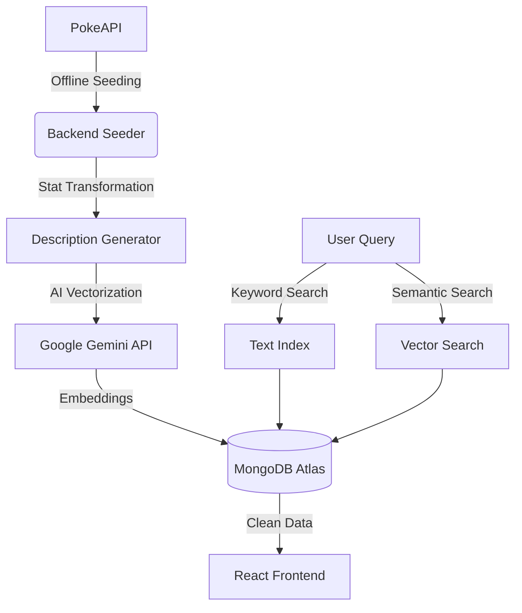

# 📟 AI-Powered PokéDex

[](https://nodejs.org/)
[](https://reactjs.org/)
[](https://www.mongodb.com/)
[](https://ai.google.dev/)

A modern, full-stack PokéDex application that goes beyond simple API fetching. This project features a **Hybrid Search Engine** combining traditional keyword matching with **AI-powered Semantic Search** using Google Gemini Embeddings and MongoDB Atlas Vector Search.

---

## ✨ Key Features

- **🤖 AI Semantic Search**: Search for Pokémon by "vibe" or intent (e.g., "fast electric attacker" or "tanky grass type") using Google Gemini's `text-embedding-004` model.
- **🔍 Hybrid Search Engine**: Toggle between traditional keyword indexing (Name/Type) and Vector-based semantic search.
- **📜 Dynamic Description Engine**: Automatically generates human-readable battle traits and descriptions based on raw Pokémon base stats.
- **🔌 Offline Data Pipeline**: Robust seeder scripts to ingest, transform, and vectorize data from PokeAPI, ensuring high performance and data ownership.
- **🎨 Retro Pixel Aesthetic**: A custom-built, responsive split-screen UI with a nostalgic GameBoy-inspired feel.

---

## 🏗️ Architecture



---

## 🛠️ Tech Stack

- **Frontend**: React (Vite), Tailwind CSS, Lucide Icons.
- **Backend**: Node.js, Express.js.
- **Database**: MongoDB Atlas (Vector Search enabled).
- **AI/ML**: Google Gemini (Embeddings).
- **ODM**: Mongoose.

---

## 🚀 Getting Started

### 1. Prerequisites
- Node.js (v18+)
- MongoDB Atlas Account (with a Cluster)
- Google AI Studio API Key (for Gemini)

### 2. Installation
Clone the repository and install dependencies:
```bash
# Install Backend deps
cd backend && npm install

# Install Frontend deps
cd ../frontend && npm install
```

### 3. Environment Setup
Create a `.env` file in the `backend/` directory:
```env
PORT=3000
MONGODB_URI=your_mongodb_atlas_uri
GEMINI_API_KEY=your_google_gemini_api_key
```

### 4. Data Seeding
Ingest and vectorize the Pokémon data:
```bash
cd backend
# Run specific scripts to populate your DB
node src/seeders/pokemon-seeder.js
node src/scripts/generateBaseDescriptions.js
node src/scripts/embedding-generator.js
```

### 5. Running the App
```bash
# Start Backend
cd backend && npm run dev

# Start Frontend
cd frontend && npm run dev
```

---

## 📂 Project Structure

```text
PokeDex/
├── backend/
│   ├── src/
│   │   ├── config/       # AI & DB configurations
│   │   ├── scripts/      # Vector & Description generation
│   │   ├── seeders/      # PokeAPI ingestion
│   │   ├── services/     # Hybrid search logic
│   │   └── models/       # Mongoose schemas with Vector Index
├── frontend/
│   ├── src/
│   │   ├── components/   # Retro UI components
│   │   └── services/     # API integration
```

---

## 📝 Search Modes Explained

| Mode | Technology | Use Case |
| :--- | :--- | :--- |
| **Keyword** | MongoDB Text Index | Exact matches for names or specific types. |
| **Semantic** | Gemini + Vector Search | Finding Pokémon based on natural language descriptions/battle roles. |

---

## 👨‍💻 Author
**Utsav** - [GitHub](https://github.com/utsxvrai)

---

> [!NOTE]
> This project was built for educational purposes to explore the integration of LLM embeddings with traditional database systems (RAG-lite architecture).
